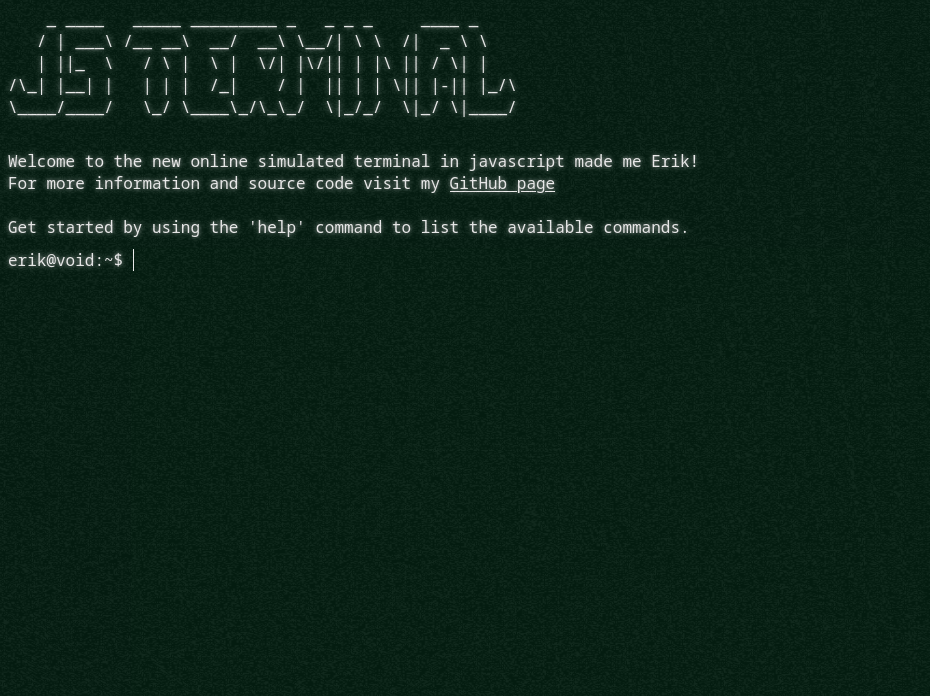

# javascript-terminal
Small javascript terminal made by me.
## Preface
I find terminals (linux terminals in particular) very aesthetic, and I've always wanted to toy around with them, but alas I have no experience in a low level language. Introducing **Web Terminal**, so I mustered up all my amateur experience in JS to create a functional albeit small terminal on the web.
### Swag
Also spiced the terminal up with some cool old school effects to give it the retro feel of the 70s (shout out to Stackoverflow). 

Preview image below:

